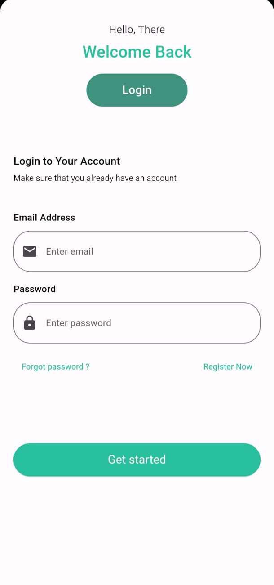
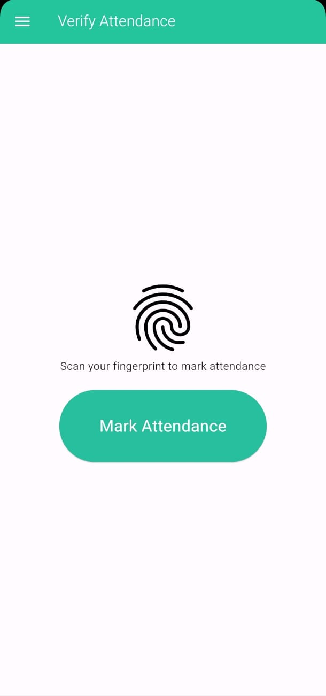

# Bluetooth Attendance Management System for Students

A mobile application that allows students to receive attendance alerts when their devices are detected by the teacher's app via Bluetooth. Students can confirm their attendance by verifying their identity using fingerprint recognition. Attendance is only marked when the student's device is detected and verified through their fingerprint.

## Features

- **Real-Time Alerts**: Receive notifications when your device is detected by the teacher's app.
- **Fingerprint Verification**: Confirm attendance using secure fingerprint recognition.
- **User-Friendly Interface**: Intuitive design for seamless navigation and management.

## Technologies Used

- **Flutter**: For building the cross-platform mobile application.
- **Firebase**: For backend services including real-time database, authentication, and storage.

## Screenshots

 
 

